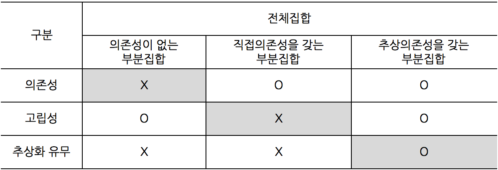



_* Unit Test(이하 단위테스트)에 대한 경험이 없으신 분들이 이 글을 읽으면 이해가 어렵지 않을까 하는 생각에, 이 글은 단위테스트에 대해 경험이 조금이나마 있으신 분들을 대상으로 하고 있음을 미리 밝혀둡니다._

누군가가 내린 단위테스트의 정의를 읽고 선뜻 단위테스트를 이해한다는 것은 불 가능한 일인 것 같습니다. Martin Folwer는 일찍이 [UnitTesting](http://martinfowler.com/bliki/UnitTest.html) 이라는 글에서 사람들이 단위테스트를 이해하는 범위가 서로 달라서 다른 개념이 통용되고 그 속에서 혼란있음을 상기시켜 주었습니다.

단위테스트란 무엇일까요? 사실 아래와 같이 단위테스트의 정의는 그리 길지 않는 문장으로 내릴 수 있을 것 같습니다. 저는 아래 문장이 단위테스트 정의 자체에 대해서는 부족함이 없다고 생각하는데, 이 글을 읽으시는 분은 어떨지 모르겠습니다.

>"코드로 만든 가장 작은 단위의 테스트"

단위테스트를 정의하는 것은 어렵지 않지만 이것만으로 단위테스트를 설명하기에는 부족합니다. 그래서 대게는 단위테스트를 이야기할 때는 정의와 더불어 좋은 단위테스트가 가져야하는 특징을 함께 이야기합니다. 그 중 중요한 특징들을 몇 가지 나열해 보면 아래와 같습니다.

* 자동화 되어야 함(automated)
* 실행속도가 빨라야 함(fast)
* 읽기 쉬워야 함(readable)
* 유지보수성이 좋아야 함(maintainable)

단위테스트의 정의 및 좋은 단위테스트가 가지는 특징들을 좀 더 자세히 살펴보면 단위테스트의 이해란 목적지에 좀 더 다가갈 수 있을 것 같습니다. 하지만 여전히 단위테스트에 익숙하지 않는 사람은 이런 논리적인 이야기들로 단위테스트를 이해하기에는 부족하다는 생각을 했습니다. 그래서 이 글에서는 코드 상에서 단위테스트를 어떻게 이해할 수 있는지를 알아보려고 합니다. 제목에서 물리적이란 단어를 쓴 이유도 앞서의 정의와 특징으로 대변되는 논리적개념과 대비시키려는 의도였습니다.

먼저 물리적으로 단위테스트 대상이 되는 전체집합을 규정하고 난 뒤, 단위테스트 대상 전체집합을 크게 아래와 같이 3가지 독립적인 부분집합으로 나누어 각각의 특징을 살펴보려합니다. 이 글에서는 단위테스트 자체의 이해보다는 테스트 대상이 되는 코드에 관심을 가집니다. 단위테스트가 아래 어떤집합에 속하는 코드를 테스트하는지, 그것이 어떤 의미를 가지는지를 살펴봄으로써, 단위테스트에 대한 이해가 한 단계 높아졌으면 하는 바램입니다.

* 의존성이 없는 부분집합
* 직접의존성을 갖는 부분집합
* 추상의존성을 갖는 부분집합

<!-- break -->

###전체집합
단위테스트에서 말하는 단위테스트 대상이 되는 가장 작은 단위는 무엇일까요? 저는 이 물음에 **public API**이라는 답을 하고싶습니다. OO언어를 예로들어, 왜 public 접근이 제한된(private, interanl) 멤버 테스트를 단위테스트에 포함시키지 말아야 하는 것일까요? [Growing Object-Oriented Software, Guided by Tests](http://www.amazon.com/gp/product/0321503627/ref=as_li_ss_tl?ie=UTF8&tag=ploeh-20&linkCode=as2&camp=1789&creative=390957&creativeASIN=0321503627)라는 책에는 아래와 같은 문장이 나오는데, 테스트를 클라인언트로 생각하면 이해가 빠를 것 같습니다. 요약해서 말하면 테스트하기 어려운 코드는 실제 클라이언트가 사용하기 힘든 코드라는 것을 이야기합니다.

>"Listen to the tests."

조금 더 깊은 얘기를 꺼내면 디자인과 관련되어 본 글의 목적을 흐릴 것 같아서 이 이야기는 다음에 다루기로 하고, 결론적으로 테스트는 클라이언트처럼 행동한다는 것입니다. 위 문장을 달리 표현하면 아래 문장이 되지 않을까 생각됩니다. 단위테스트는 실제 클라이언트처럼 non-public API에 접근하지 않는다는 의미를 내포하고 있습니다.

>"Unit tests are the first client."

그런데 단위테스트가 non-public API에 접근하여 테스트하는 것은 불가능한 일이 아니면 그리 어려운 작업도 아닙니다. 닷넷 환경에서는 [InternalVisibleToAttribute](https://msdn.microsoft.com/en-us/library/system.runtime.compilerservices.internalsvisibletoattribute.aspx)라는 어셈블리 특성을 이용해 internal 액세스 수준의 프로덕션 코드를 public API처럼 외부에 노출 시킬 수 있습니다. 그리고 `InternalVisibleToAttribute`가 아니더라도 리플렉션(reflection)을 통하면 non-public API에 언제든 접근이 가능합니다.

단위테스트가 프로덕션 코드에 대한 접근성이 좋으면 그 만큼 프로덕션 코드를 테스트하기 편해지기 때문에 **단위테스트 접근성은 테스트 편의성과 직결**됩니다.(testability)

문제는 단위테스트 접근성이 높으므로 인한 **테스트 편의성(testability)과 코드수정 편의성은 서로 반비례 관계**에 있다는 것입니다. 가령, 단위테스트가 private 메소드를 테스트하고 있는 경우가 아니라 public 메소들를 테스트 하는 경우라면, 후자는 private 메소드를 리팩토링해도 그 영향이 테스트 변경으로 이어지지 않지만, 전자의 경우는 그렇지 못합니다.
우리는 테스트와 코드 수정 편의성의 두 마리 토끼를 다 잡고 싶지만 그럴 수 없기 때문에 두 지점 사이에 어느 적정 수준을 찾아야하는데 그 지점이 public API이라는 것입니다. **단위테스트 대상의 전체집합을 public API 전체로 정의**하고 이야기를 계속 이어가 보겠습니다.

### 의존성이 없는 부분집합
단위테스트 대상이 되는 전체 집합(public API)에서 가장 먼저 소개할 것이 의존성이 없는 부분집합입니다. 아래 `Validates` 메소드는 입력 받은 `email`이 유효한지를 검사하는 기능을 제공하는 코드로 [StackOverflow의 한 질문에서 가져온 코드](http://stackoverflow.com/questions/1365407/c-sharp-code-to-validate-email-address)입니다. 우리는 이 메소드를 의존성이 없는 부분집합에 속하는 것으로 볼 수 있습니다. `Validates`가 `MailAddress` 메소드에 의존함에도 불고하고 이 부분집합에 넣을 수 있는 이유는 `MailAddress` 메소드는 시스템 외부인 BCL(Base Class Library)에 속하기 때문에 우리는 이를 주어진 것으로 보고 의존성 카테고리에 넣지 않기 때문입니다. `MailAddress`는 `==` 연산자처럼 항상 문제없이 실행된다고 가정이 있는 것이죠.

```c#
public class EmailValidator
{
    public static bool Validates(string email)
    {
        try
        {
            var result = new System.Net.Mail.MailAddress(email);
            return result.Address == email;
        }
        catch
        {
            return false;
        }
    }
}
```
의존성이 없는 부분집합의 특징을 살펴보면, 먼저 다른 부분집합들과 비교해 상대적으로 단위테스트가 쉬운 집합이다는 것입니다. 의존성을 가지지 않기 때문에 단위테스트를 시작하는 사람에게 설명하기 좋은 경우이기도 합니다.

이 부분집합에 속하는 코드는 꼭 하나의 메소드로 이루어질 필요가 없습니다. 위 코드를 아래와 같이 재작성해보겠습니다. `ValidatesUsingMailClass` 라는 private 메소드를 만들었습니다. 구조는 변했지만, 내부로직은 아무변함이 없습니다.(리팩토링) 이렇게 되면 위 경우에 만들어진 단위테스트들은 프로덕션 코드가 아래와 같이 리팩토링 됨으로 어떤 영향을 받게 될까요? 그렇습니다, 당연히 아무런 영향을 받지 않습니다. 이 부분집합에 속하는 코드는 하나의 public API를 테스트하지만, 이것이 아무리 많은 non-public API를 거치는지는 관심이 없으며 오로지 테스트 대상이 되는 public API 변경에만 관심이 있습니다.

```c#
public class EmailValidator
{
    public static bool Validates(string email)
    {
        try
        {
            return ValidatesUsingMailClass(email);
        }
        catch
        {
            return false;
        }
    }

    private static bool ValidatesUsingMailClass(string email)
    {
        var result = new System.Net.Mail.MailAddress(email);
        return result.Address == email;
    }
}
```

### 직접의존성을 갖는 부분집합
첫 번째 집합은 의존성이 없어서 비교적 간단했습니다. 제일 먼저 소개한 이유도 이 때문입니다. 이제 두 번째 집합을 살펴 볼 차례인데요. 두 번째의 경우는 직접 의존성을 가지는 경우를 말합니다. 아래 코드는 흔히 볼 수 있는 사용자 가입과 관련된 코드인데, `RegisterUser` 메소드는 `EmailValidator.Validates` 메소드와 `UserManager.AddUser` 메소드에 의존하고 있습니다. 문제를 단순화 시키기 위해 `Validates` 메소드에만 초점을 맞춰보겠습니다.

직접의존성을 갖는 부분집합의 특징은 아래코드의 public API들이 outside-in 방식으로 만들어졌는지, 아니면 inside-out 방식으로 만들어졌는지로 나누어 살펴볼 필요가 있습니다. outside-in 방식은 클라이언트가 접근하는 순서를 따른 것으로 바깥 쪽의 `RegisterUser` 메소드를 먼저 만들고 그 다음 안쪽의 `Validates` 메소드를 만든 경우를 말하며, insdie-out 방식은 그 반대의 경우를 말합니다.

```c#
public class UsersConroller
{
    public void RegisterUser(string email, string password)
    {
        if (!EmailValidator.Validates(email))
        {
            throw new ArgumentException("Invalid email format.");
        }

        new UserManager().AddUser(email, password);
    }
}
```

**Outside-in 방식**  
outside-in 방식으로 접근하면 처음에는 아래코드와 같이 public API 시각에서 `RegisterUser` 메소드에 email 유효성 검사 로직이 녹아 있었을 것입니다. 이 시점이 앞서 설명된 의존성이 없는 부분집합의 경우이며, email 유효성 검사로직이 다른 메소드(`Validates`)에서 구현이 되든, 해당 메소드가 아예 다른 non-public class에 속하든 그건 문제가 되지 않습니다. **`RegisterUser` 메소드에 대한 단위테스트가 `Validates` 메소드 로직까지 테스트한다는 것이 중요**합니다.

```c#
public class UsersConroller
{
    public void RegisterUser(string email, string password)
    {
        if (!Validates(email))
        {
            throw new ArgumentException("Invalid email format.");
        }

        new UserManager().AddUser(email, password);
    }

    private static bool Validates(string email)
    {
        try
        {
            var result = new System.Net.Mail.MailAddress(email);
            return result.Address == email;
        }
        catch
        {
            return false;
        }
    }
}
```
 그 후, `Validates` 메소드의 public API 요구로 앞서 `EmailValidator.Validates` 메소드와 같이 노출이 되면 `RegisterUser` 메소드는 이를 사용하게 되어 직접의존성을 갖는 부분집합에 속하는 코드가 됩니다.

노출된 `Validates` 메소드는 `RegisterUser` 메소드의 단위테스트에 의해 이미 테스트되고 있는 상태이지만, 테스트 구성(test organization)에 문제가 생깁니다. 예를들어 하나의 클래스당 하나의 테스트클래스를 만드는 경우라면 이 경우 하나의 테스트 클래스가 두 개의 클래스를 커버하는 상황이기 되기 때문입니다. 나중에 `Validates` 메소드에 대한 단위테스트가 추가될 때는 이 테스트를 어디에 위치시켜야 될지 결정이 애매할 수 있습니다. 더욱이 `UsersConroller` 클래스가 삭제되어 이에 대한 테스트클래스가 삭제되는 상황이라면, `Validates` 메소드의 단위테스트가 날아가버리는 사고가 생길 수 있습니다.

이 문제를 해결하기 위해서는 `EmailValidator.Validates`가 public API로 노출이 될 때, 이 메소드에 대한 단위테스트를 독립적으로 작성을 해주어야 합니다. 이 경우 `Validates`를 다시 작성해야하는 번거로움과 테스트 중복이란 문제가 생깁니다. 이는 어떤 선택에 정답이 있다기 보다는 개인 선호도의 문제로 봐야할 것 같습니다.

**Inside-out 방식**  
inside-out 방식에서는 앞서 outside-in 방식과는 다르게 먼저 `EmailValidator.Validates` 메소드가 public API로 작성이 되어 있는 경우입니다. 이 `Validates` 메소드 자체는 앞서에서 봤듯이 의존성이 없는 부분집합에 속하는 코드입니다. inside에서 한발 바깥으로 나오면 이제 `UsersController.RegisterUser` 메소드를 구현할 차례입니다. 이때 `RegisterUser` 메소드가 `Validates` 메소드에 직접의존성을 갖는다면, 이론적으로 `Validates` 메소드에 대한 테스트를 중복해서 작성해야합니다. 왜냐하면, 클라이언트인 단위테스트 입장에서 `RegisterUser` 메소드가 `Validates` public API를 사용하는지 아님 자체적인 구현을 가지고 있는지 알길이 없기 때문입니다. (Microsoft Fakes 프레임워크의 Shim과 같은 기능을 이용하면 이 문제를 해결할 수 있습니다만, 통상의 OO 개념이 아니기 때문에 논외로 하겠습니다.)

inside-out 방식에서 테스트 코드 중복문제를 피하고 싶으면 조금 러프(rough)하게 접근하는 것도 하나의 대안이 될 수 있을 것 같습니다. `RegisterUser` 메소드에 대한 테스트에서 email 유효성 검사에 관한 테스트케이스가가 `Validates` 의존성 메소드를 호출할 만큼 완벽하지 않더라도 실제 코드에서는 이를 호출하는 코드로 작성하는 것입니다.

### 추상의존성을 갖는 부분집합
추상의존성을 갖는 부분집합의 경우에서는 아래코드와 같이 `IEmailValidator`와 같은 추상화를 통해 `Validates` 메소드 의존성을 고립화(isolation) 시킬 수 있습니다. 의존성의 고립으로 이 부분집합에 속하는 코드는 ouside-in 혹은 inside-out의 어떤 방식을 택하더라도, `RegisterUser` 메소드 구현은 `Validates` 메소드의 구체적인 구현과는 무관하게 됩니다.

```c#
public interface IEmailValidator
{
    bool Validates(string email);
}

public class UsersConroller
{
    private readonly IEmailValidator emailValidator;

    public UsersConroller(IEmailValidator emailValidator)
    {
        this.emailValidator = emailValidator;
    }

    public void RegisterUser(string email, string password)
    {
        if (!this.emailValidator.Validates(email))
        {
            throw new ArgumentException("Invalid email format.");
        }

        new UserManager().AddUser(email, password);
    }
}
```

앞서 직접의존성을 갖는 부분집합의 inside-out 접근방식에서는 테스트 코드를 중복해서 작성해야하는 문제가 있었습니다. 이 경우 추상의존성을 갖는 부분집합의 코드로 작성하여 의존성을 격리 시킨다면 테스트 코드 중복 문제를 해결할 수 있습니다. 하지만 시스템 전체적 디자인 관점에서 본다면 오로지 테스트 코드 중복을 피하기 위해 `IEmailValidator`와 같은 추상화를 도입한다는 것은 좋은 디자인이라 할 수 없을 것입니다.

아래 코드는 실제 `IEmailValidator` 추상화를 이용하여 `Validates` 메소드들 고립시켜 단위테스트 하는 것을 보여주고 있습니다. 실제 `Validates` 메소드 구현과는 상관없이 아래 단위테스트에서는 이를 항상 `false`의 값을 리턴하도록 가장하였습니다. 이로 `RegisterUser` 메소드는 email 유효성 검증이 실패함에 따라 `ArgumentException` 예외를 발생시키게 됩니다.

```c#
public class UsersControllerTest
{
    [Fact]
    public void RegisterUserThrowsWhenValidatatesReturnsFalse()
    {
        // Arrange
        var validator = new DelegatingEmailValidator
        {
            DelegatingValidates = x => false
        };

        var sut = new UsersConroller(validator);

        // Act & Assert
        Assert.Throw<ArgumentException>(() =>
            sut.RegisterUser("dumy email", "dumy password"));
    }

    private class DelegatingEmailValidator : IEmailValidator
    {
        public Func<string, bool> DelegatingValidates { get; set; }

        public bool Validates(string email)
        {
            return this.DelegatingValidates(email);
        }
    }
}
```

### 요약 및 결론
이상에서 테스트 대상 전체집합(public API)을 3가지 부분집합으로 나누어 그 특징을 살펴보았습니다. 부분집합간의 비교를 통해 각 부분집합은 어떤 차이점을 가지는지를 정리하면 아래 표와 같습니다. 의존성이 없는 부분집합은 다른 부분집합들과 비교해 의존성이 없는 것을 특징으로 하고, 직접의존성을 갖는 부분집합의 경우는 고립성이 없는 것이 특징이며, 그리고 추상의존성을 갖는 부분집합의 경우는 추상화를 가지고 있다는 것을 그 특징으로 하고 있습니다.



결론적으로 단위테스트는 public API 테스트를 말하는 것입니다. public API테스트를 작성하고 테스트 대상 코드가 어느 부분집합에 속하는지 고려해보세요. 의존성이 없는 코드는 가장 단순한 부분집합에 속합니다. 의존성이 없기 때문에 특별히 고려될 점이 없습니다만 요구사항이 많아지면, 내부로직이 public API로 분리될 수 있습니다. 직접의존성을 갖는 부분집합에 속하는 코드는 의존성에 대한 단위테스트 중복이 발생할 수 있습니다. 하지만 추상화를 도입하지 않으므로 디자인에 대한 부담은 상대적으로 적습니다. 반대로 추상의존성을 갖는 집합에 속하는 코드는 의존성이 고립되어서 의존성 단위테스트 중복은 사라집니다. 그러나 추상화 도입으로 인한 디자인 부담이 커지게 됩니다.

이상으로 말씀드린 부분집합별 특징과 문제점을 단위테스트 작성에 앞서 미리 알고 계시면 코드 작성에 도움이 되지 않을까 하는 생각해 봅니다.