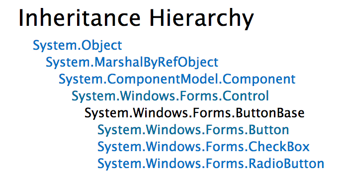



최근들어 주변에서 구성(composition)과 상속(inheritance)에 대해 얘기하는 것을 많이 듣게 되었습니다. 예전부터 구성과 상속에 대해 개인적인 생각을 한번 정리하고 싶었습니다. 이 기회를 빌려 그동안 미뤄왔던 생각을 정리해볼까 합니다.

구성과 상속은 코드 재사용 방법에서 큰 비중을 차지합니다. 이 둘은 코드 재사용 면에서는 공통점이 있지만 클래스 혹은 개체(object) 간 관계를 표현하는 것에는 차이를 보입니다. 구성은 특정 기능의 개체를 가지는 것으로 HAS-A관계를 의미합니다. 반면 상속은 부모에서 구현된 멤버가 자식 클래스를 통해 노츨되는 것으로 IS-A관계를 의미합니다. GoF의 디자인패턴 책에서 아래과 같이 _상속보다는 구성을 활용하라_ 는 원칙을 제시합니다. 이 글에서는 왜 IS-A관계보다 HAS-A관계가 좋은지, 어떤 경우에 IS-A관계를 쓸 수 있는지 알아보려 합니다. 결론에서는 HAS-A 사용에 대한 실천적인 방법에 대해서도 살펴보겠습니다.

> Faver object composition over class inheritance.

<!-- break -->

### HAS-A

현실 세계에서는 대게의 경우 '자동차는 바퀴를 가지고 있다', '사람은 동물이다' 와 같이 직관적으로 HAS-A / IS-A관계 구분이 가능합니다. 하지만 소프트웨어 세상에서는 직관적이지 못할 때가 많습니다.

데이터를 CRUD 하는 클래스를 작성하려 합니다. 엔티티마다 CRUD 작업클래스를 `UserRepository`, `ProductRepository` 와 `OrderRepository` 같은 클래스들을 생각할 수 있습니다. 각 클래스는 아래와 같이 실제 데이터베이스에서 CRUD 작업 처리를 위해 `DbContext` 와 같은 속성을 가지게 됩니다. `DbContext`는 .NET환경에서 사용되는 ORM 도구인 Entity Framework의 클래스입니다. SQL 구문 실행을 위한 `DbConnection`, `DbCommand` 클래스와 같은 용도로 이해하시면 됩니다. 아울러, 각 `Repository`는 SQL 구문이 처리된 후 로그를 남길 필요가 있다고 가정해보겠습니다. `DbContext`와 로깅 기능을 각 클래스에 담아두는 것은 코드가 중복됩니다. 중복코드를 파하기 위해 아래와 같은 `RepositoryBase` 클래스를 만들었습니다.

`RepositoryBase` 클래스는 설명에 필요한 부분만 표현되었습니다. "..." 표시는 자세한 코드가 생략되었다는 것을 의미합니다.


```c#
public class RepositoryBase
{
    ...

    public DbContext DbContext { get; }

    public void Log(string message)
    {
        ...
    }

    ...
}
```

`RepositoryBase`를 상속받아 아래와 같은 `UserRepository` 클래스를 만들 수 있습니다. 부모클래스에서 구현된 멤버를 이용해서 새 `User`를 DB에 추가하는 코드를 작성할 수 있습니다.

```c#
public class UserRepository : RepositoryBase
{
    ...
    public void Insert(User user)
    {
        DbContext.Set<User>().Add(User);
        DbContext.SaveChanges();
        Log("New user inserted");
    }
    ...
}
```

부모(`RepositoryBase`) 클래스에서 구현된 `DbContext`와 `Log` 멤버들이 자식(`UserRepository`) 클래스에서 사용될 뿐 자식클래스에서 노출될 필요는 없습니다. public의 부모 멤버들은 protected 접근한정자로 충분합니다. 자식 클래스에서는 부모 클래스 멤버를 상속한 IS-A 관계가 아닌 HAS-A 관계로 충분히 설명될 수 있습니다. 상속보다는 구성이 바람직한 경우입니다.

상속은 디자인타임에 결정되는 것으로 런타임에서 상속된 기능을 교체할 수 없습니다. 반면 구성을 사용하면 이 문제를 극복할 수 있습니다. 로그를 파일에 기록할지 아니면 데이터베이스에 기록할지를 런타임에 결정할 수 있습니다. 굳이 런타임 시점이 아니더라도, 아래 코드와 같이 [로그를 어디에 남길지 `UserRepository` 클래스 변경 없이 디자인타임에 결정하는 것도 구성의 장점입니다.](https://en.wikipedia.org/wiki/Open/closed_principle)

```c#
var userRepositoryWithFileLogger = new UserRepository(
    new EnvicaseDbContext(), new FileLogger());

// or

var userRepositoryWithDbLogger = new UserRepository(
    new EnvicaseDbContext(), new DbLogger());
```

### IS-A
상속보다 구성을 사용하라는 디자인 원칙은 상속을 사용하지 말라는 의미는 아닐 것입니다. 상속이 사용된 좋은 예는 UI를 구성하는 요소들을 표현하는 클래스들에서 표현되는 상속관계입니다. 윈폼을 구성하는 모든 요소들은 아래 그림에서 보여지는 `Control` 클래스를 상속합니다.



`Control` 클래스를 상속하는 모든 자식 클래스들은 `Control` 클래스에서 구현된 모든 멤버들이 노출되어 재사용됩니다. 예를 들어, `BackColor` 속성은 요소의 배경색을 지정할 수 있도록 합니다. `Control`을 상속하면 `BackColor` 속성을 재사용할 수 있어 코드 중복을 피할 수 있습니다. 이 같이 부모 클래스에서 구현된 모든 멤버가 자식 클래스에서 노출되어 부모 코드를 재사용할 수 있는 곳에 상속을 사용할 수 있습니다.

**상속의 사용은 디자인 정교함이 따라야 합니다.** 위 그림에서 `RadioButton`과 `CheckBox` 클래스 모두 `Checked` 속성을 가지고 있습니다. 모든 버튼이 이 속성을 가질 것으로 오판해서 `ButtonBase` 부모 클래스에 이 속성을 선언했다고 가정해보죠. `Button` 클래스는 `Checked` 속성이 불필요함에도 불구하고 상속할 수 밖에 없습니다. `ButtonBase`에서 정의된 `Checked` 속성이 `Button`에는 동작하지 않게 되므로 [_"서브타입은 언제나 자신이 기반타입 (base type)으로 교체할 수 있어야 한다"_ 는 LSP원칙을 위반하게 됩니다.](https://en.wikipedia.org/wiki/Liskov_substitution_principle) 반면 구성은 그렇지 않습니다. 불필요한 멤버를 가진 클래스를 의존하지 않을 수 있습니다. 만일에 의존하다고 하더라도 불필요한 멤버를 사용하지 않으면 그만입니다.

### IS-A + HAS-A
구성이 적절한 곳에 상속이 사용되는 또 다른 경우가 부모 클래스(IS-A관계)에 HAS-A 관계인 멤버를 밀어 넣은 경우입니다. 모든 Service 클래스들은 서비스이름이 필요하다고 해보죠. `ServiceName` 속성을 부모 클래스에 한번 구현하는 것으로 자식 클래스에 노출되어 사용될 수 있습니다.

```c#
public abstract class ServiceBase
{
    public string ServiceName
    {
        get { return this.GetType().Name; }
    }
}
```

그런데 일부 자식 Service 클래스들에서 로깅 기능이 필요하다고 합니다. 로깅 기능을 각 Service 클래스에서 구현하면 중복코드가 발생하기 때문에 아래와 같이 `Log` 메소드를 부모클래스에서 구현하였습니다. `Log` 메소드는 자식클래스로 상속이 되어 public으로 노출될 필요가 없습니다. `Log` 메소드는 HAS-A관계로 표현되는 것이 적절합니다.

IS-A관계를 잘못 사용하면 `Log` 메소드와 같이 일부 자식 클래스에서 필요한 구현이 코드재사용이라는 명분아래 부모에 추가되는 경우가 늘어납니다. [자식은 부모가 God 이길 바라면 안됩니다.](https://en.wikipedia.org/wiki/God_object) IS-A 관계의 부모 클래스가 있더라도, HAS-A관계가 적합할 경우는 구성을 사용해야합니다. `Log` 메소드를 부모 클래스에 밀어 넣으면 안되는 것입니다. 

```c#
public abstract class ServiceBase
{
    public string ServiceName
    {
        get { return this.GetType().Name; }
    }

    public void Log(string message)
    {
        ...
    }
}
```

### 결론
상속보다 구성을 사용하라는 의미를 잘 이해하고 있더라도, 막상 작업할 때는 구성을 사용해야 하는 곳에 상속을 사용해버리는 경우가 있습니다. 구현 시나리오를 이해하고 코드를 작성하는 것에 집중하다 보면, 구성을 사용할 것인가 상속을 사용할 것인가라는 고민을 깊게 하지 못하게 됩니다. 잘못된 상속을 사용하는 경우를 피하기 위해서는 **상속을 중복코드 제거를 위한 최후의 보루** 로 두는 것이 좋습니다. 상속을 사용하고 싶은 곳이 있다면, [코드 중복을 한번 허락 해버리거나(Rule of three)](https://en.wikipedia.org/wiki/Rule_of_three_(computer_programming)) 구성을 사용하는 것이 더 좋은 선택이 아닌지 먼저 고민해야 합니다. **코드 재사용성만이 강조되어 코드 유연성을 저해하는 상속 사용은 금물입니다.**

> 상속은 중복코드를 제거하는 최후의 보루이다.