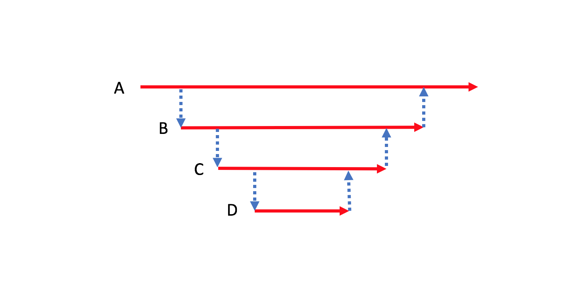



[이전 글에서는 테스트하기 어려운 코드와 쉬운 코드를 어떻게 구분하는가에 대해 알아보았다.](/testable-code) TDD, Unit Tests 같은 [테스트를 설명하는 글 속에서 만나게 되는 예제들](http://osherove.com/tdd-kata-1/)은 대부분 테스트하기 쉬운 경우에 속한다. 테스트하기 어려운 코드로 테스트를 쉽게 설명할 수 없기 때문이다. 그런데 실제 프로젝트에서 만나게 되는 코드들은 테스트하기 쉬운 경우만 있는 것이 아니다. 요구사항을 구현하기 위해 메일도 보내야하고 데이터베이스에 데이터를 저장하거나 읽어야 한다. 소프트웨어를 통해 이루려는 것은 필연적으로 외부세상과 소통을 필요로 하기 때문에 테스트하기 어려운 코드는 피할 수 없는 것이다. 

테스트하기 어려운 코드를 피할 수 없다면 이를 최대한 줄이려는 노력은 필요한다. 바꿔말해 테스트하기 쉬운 코드를 가능한 많이 작성해야 한다는 뜻이다. 이런 노력은 궁극적으로 **테스트에 드는 비용을 최소화하기 위함**이다.

<!-- break -->

### 테스트하기 어려운 코드와 쉬운 코드 분리

이메일과 비밀번호를 입력받아 회원가입하는 시나리오를 생각해보자. C#으로 시나리오를 구현하면 아래와 같은 모습이 된다. `...` 은 코드가 생략되었음을 의미한다. 이메일, 비밀번호가 유효하면 그 정보를 `UserStore`을 이용해 데이터베이스에 저장하고 그렇지 않으면 예외를 던진다. 이메일과 패스워드가 유효한 형식인지만 테스트할려고 해도 어쩔 수 없이 데이터베이스를 통한 통합테스트를 하거나, [test double 을 이용해야 한다.](http://xunitpatterns.com/Test%20Double.html) 테스트 비용이 높은 경우로 테스트하기 어려운 코드다. 테스트하기 어려운 코드란 것을 단번에 알 수 있는 방법이 있다. `SignUp` 메소드의 리턴타입을 보자. `Task` 타입, IO 관련 작업이다. [IO 관련작업은 외부세상과 소통을 의미함으로 테스트하기 어려운 경우라 이전 글에서 얘기되었다.](/testable-code#리턴타입별-테스트-용이성)

```c#
public async Task SignUp(string email, string password)
{
    // 이메일이 유효한지 검사합니다.
    if (!email.Contains("@"))
        throw new ArgumentException("유효한 이메일 형식이 아닙니다.");
    ...

    // 비밀번호가 유효한지 검사합니다.
    if (password.Length >= 8)
        throw new ArgumentException("비밀번호는 최소 8자리 이상입니다.");
    ...

    await UserStore.AddAsync(email, passwod);
}
```

테스트하기 쉬운코드를 테스트하기 어려운 코드(`UserStore.AddAsync`)와 섞음으로 모든 코드가 테스트하기 힘들게 되었다. 해답은 간단하다. 테스트하기 쉬운코드와 어려운 코드를 분리시키자. 테스트하기 쉬운 코드를 최대한 어려운 코드에서 분리하여 순수함수 형태로 만들면 된다.

이 경우 테스트하기 쉬운코드를 분리하여, `Email`과 `Password` 을 만들면 좋겠다. 아래와 같이 생성자에서 문자열 값을 받아 유효한 형식인지 체크할 수 있다.

```c#
public class Email
{
    public Email(string value)
    {
        // 이메일이 유효한지 검사합니다.
        if (!value.Contains("@"))
            throw new ArgumentException("유효한 이메일 형식이 아닙니다.");

        this.Value = value;
    }

    public string Value { get; }

    public static bool TryParse(string value, out Email email)
    {
        try
        {
            email = new Email(value);
            return true;
        }
        catch (ArgumentException)
        {
            email = null;
            return false;
        }
    }
}
```

### 테스트하기 어려운 코드는 가장 바깥 쪽에 위치

아래 그림과 같이 A 메소드가 B를 호출하고 B메소드가 C, 그리고 D 이런 순서를 가진 콜스택을 생각해보자. 이때 D 메소를 IO 관련 메소드라고 분류하여 빨간색으로 나타내보자.


그러면 B, C 그리고 A 메소드가 테스트하기 쉬워도 아래 그림처럼 D 메소드의 테스트 어려움이 모든 메소드에 전파가 된다. 위 `SignUp` 경우에서 테스트하기 쉬운 코드가 분리되기 전 모습과 같다. 테스트 어려움 전파를 막기 위해 테스트하기 어려운 코드(D)와 쉬운 코드(B, C)를 분리 한다. A 메소드는 콜스택에서 가장 바깥 쪽에 위치하여 진입점이 되어 분리될 수 없다.



분리된 D 메소드는 어디에든 위치시켜야 한다. `SignUp` 경우에서 `UserStore.AddAsync` 메소드가 어디에든 위치하여 실행되어야 사용자 정보가 저장이 회원가입이 마무리 된다. 테스트 하기 어려운 함수가 콜스택 안쪽에 위치할수록 테스트 하기 어려운 코드가 많아진다. 테스트 비용이 증가된다. 따라서 아래 그림처럼 테스트하기 어려운 코드는 가장 바깥쪽에 위치시켜야 테스트 비용을 최소화 시킬 수 있다. 이때 테스트 어려운 D 메소드의 진입점을 제공하는 A 메소드는 선택할 여지없이 테스트하기 어려운 코드로 분류된다.


### Function Root

A 메소드는 특정 기능 수행의 진입점 역할을 한다. 