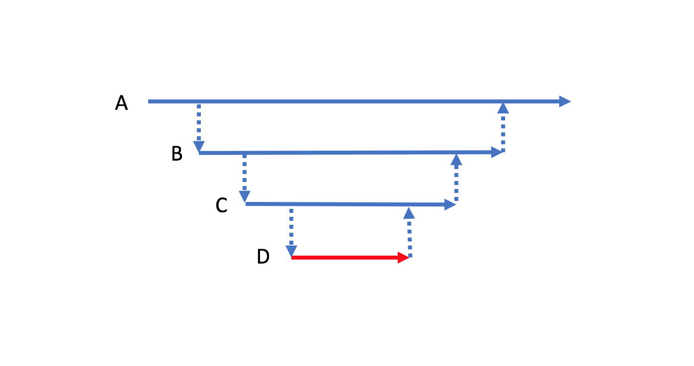
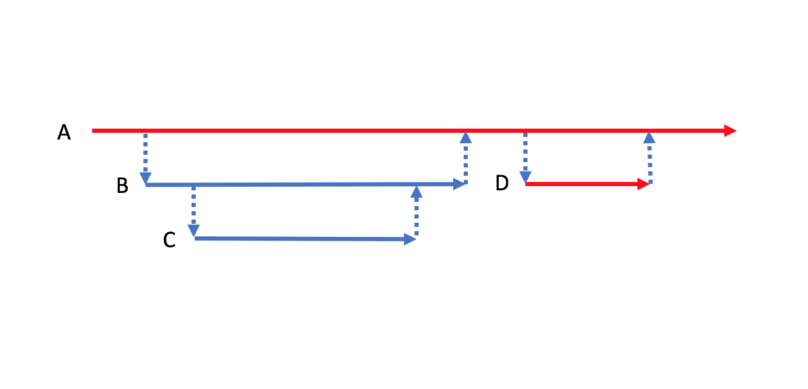



[이전 글에서 테스트하기 어려운 코드와 쉬운 코드를 어떻게 구분하는가에 대해 알아보았다.](/testable-code) [TDD, Unit Test 를 설명하는 글 속에서 만나게 되는 예제](http://osherove.com/tdd-kata-1/)는 대부분 테스트하기 쉬운 경우에 속한다. 테스트하기 어려운 코드로 테스트를 쉽게 설명할 수 없기 때문이다. 실제 프로젝트에서는 테스트하기 쉬운 코드만 있는 것이 아니다. 요구사항을 구현하기 위해 메일도 보내야하고 데이터베이스에 데이터를 저장하거나 읽어야 한다. 소프트웨어를 통해 이루려는 것은 필연적으로 외부세상과 소통이 필요하기 때문에 테스트하기 어려운 코드는 피할 수 없다. 우리는 이를 최대한 줄이려고 노력해야 한다. 테스트하기 쉬운 코드를 가능한 많이 작성해야 한다는 뜻이다. 이런 노력은 궁극적으로 **테스트에 드는 비용을 최소화하기 위함**이다.

<!-- break -->

### 테스트하기 어려운 코드와 쉬운 코드 분리

이메일과 비밀번호를 입력받아 회원가입하는 시나리오를 생각해보자. C#으로 시나리오를 구현하면 아래와 같은 모습이 된다. `...` 은 코드가 생략되었음을 의미한다. 이메일, 비밀번호가 유효하면 그 정보를 `UserStore`를 통해 데이터베이스에 저장하고 그렇지 않으면 예외를 던진다. 이메일과 비밀번호가 유효한 형식인가를 테스트하려고 해도 어쩔 수 없이 데이터베이스를 통한 통합테스트를 하거나, [Test Double 을 이용해야 한다.](http://xunitpatterns.com/Test%20Double.html) 테스트 비용이 높은 경우로 테스트하기 어려운 코드다. 이를 단번에 알 수 있는 방법이 있다. `SignUp` 메소드의 리턴타입을 보자. `Task` 타입, IO 관련 작업이다. [IO 관련작업은 외부세상과 소통을 의미하므로 테스트하기 어려운 경우다.](/testable-code#리턴타입별-테스트-용이성)

```c#
public async Task SignUp(string email, string password)
{
    // 이메일이 유효한지 검사합니다.
    if (!email.Contains("@"))
        throw new ArgumentException("유효한 이메일 형식이 아닙니다.");
    ...

    // 비밀번호가 유효한지 검사합니다.
    if (password.Length < 8)
        throw new ArgumentException("비밀번호는 최소 8자리 이상입니다.");
    ...

    await UserStore.AddAsync(email, passwod);
}
```

테스트하기 쉬운코드를 테스트하기 어려운 코드(`UserStore.AddAsync`)와 섞음으로 모든 코드가 테스트하기 힘들게 되었다. 해답은 간단하다. 이들을 분리시키자. 테스트하기 쉬운 코드를 최대한 어려운 코드에서 분리하여 순수함수 형태로 만들면 된다.

이 경우 테스트하기 쉬운코드를 분리하여, `Email`과 `Password` 타입을 만들면 좋겠다. (Primitive Obsession) 아래와 같이 생성자에서 문자열 값을 받아 유효한 형식인지 체크할 수 있다.

```c#
public class Email
{
    public Email(string value)
    {
        // 이메일이 유효한지 검사합니다.
        if (!value.Contains("@"))
            throw new ArgumentException("유효한 이메일 형식이 아닙니다.");

        ...
        
        this.Value = value;
    }

    public string Value { get; }

    public static bool TryParse(string value, out Email email)
    {
        try
        {
            email = new Email(value);
            return true;
        }
        catch (ArgumentException)
        {
            email = null;
            return false;
        }
    }
}
```

### 테스트하기 어려운 코드는 가장 바깥 쪽에 위치

아래 그림과 같이 A 메소드가 B를 호출하고 B메소드가 C, 그리고 D 이런 순서를 가진 콜스택을 생각해보자. 이때 D 메소를 IO 관련 메소드라고 분류하여 빨간색으로 나타내보자.



그러면 B, C 그리고 A 메소드가 테스트하기 쉬워도 아래 그림처럼 D 메소드의 테스트 어려움이 모든 메소드에 전파 된다. 위 `SignUp` 경우에서 테스트하기 쉬운 코드가 분리되기 전 모습과 같다. 이런 테스트 어려움이 전파되는 것을 막기 위해 테스트하기 어려운 코드(D)와 쉬운 코드(B, C)를 분리할 필요가 있다. A 메소드는 콜스택에서 가장 바깥 쪽에 위치하여 진입점이 되어 분리될 수 없다.


분리된 D 메소드는 어디에든 위치시켜야 한다. `SignUp` 경우에서 `UserStore.AddAsync` 메소드가 어디에든 위치하여 실행되어야 사용자 정보가 저장되어 회원가입이 마무리된다. 테스트하기 어려운 함수가 콜스택 안쪽에 위치할수록 테스트하기 어려운 코드량이 늘어난다. 테스트 비용이 증가되는 것이다. 따라서 아래 그림처럼 테스트하기 어려운 코드를 가장 바깥쪽에 위치시키면 테스트 비용을 최소화할 수 있다. 이때 진입점 역할을 하는 A 메소드는 선택할 여지없이 테스트하기 어려운 코드로 분류된다.



### Function Root

A 메소드는 특정 기능 수행의 진입점 역할을 한다. 테스트하기 어려운 IO 관련 코드를 담고 있는 경우가 많다. 그래서 그 자신 역시 테스트하기 어려운 형태가 되는 특징이 있다. 이런 메소드 또는 함수를 Function Root라 하자.

[어플리케이션에 필요한 모듈들을 한꺼 번에 구성할 수 있는 장소를 Composition Root라고 한다.](http://blog.ploeh.dk/2011/07/28/CompositionRoot/) Composition Root는 프로그램 시작점이지만, Function Root는 기능 시작점이라는 것에 차이점이 있다.

Function Root가 될 수 있는 위치를 프레임워크 별로 나눠 생각해보면 다음과 같다

* UI 프로그램의 이벤트 핸들러
* Web API의 액션메소드
* Azure Functions 또는 AWS Lambda에서 호출되는 함수
* etc 

### Summary

테스트 비용을 줄이기 위해 테스트하기 쉬운코드를 많이 작성해야 함은 자명한 사실이다. 그러기 위해 테스트하기 어려운 IO 코드를 그렇지 않은 코드로 부터 물리적으로 분리 시키자. 그러면 테스트하기 쉬운 순수함수 코드를 얻을 수 있다. 테스트 하기 어려운 IO 관련 코드는 Function Root 에 위치시키자. Function Root에서 콜스택 안쪽으로 들어 갈수록 테스트 비용이 증가하기 때문이다.

아래 흐름을 보자. `-->` 표시는 참조한다, 의존한다는 의미다. 중요한 모듈(Domain Model)이 상대적으로 덜 중요한 모듈(Data Access)에 의존하고 있다. [Dependency Inversion Principle(DIP) 위배에 해당한다.](https://en.wikipedia.org/wiki/Dependency_inversion_principle)

> User Interface Module --> Domain Model Module --> Data Access Module

위 경우는 다음과 같이 바뀌어야 한다. Domain Model이 Data Access에 의존하는 것이 아니라 그 반대가 되어야 한다. 테스트 비용 입장에서 봐도 Domain Model이 Data Access에 의존하면 테스트 어려움 때문에 테스트 비용이 증가하게 된다. Domain Model은 온전히 IO관련 작업에서 분리되어 순수함수 형태의 코드로 테스트 되는 것이 좋다.

> User Interface Module --> Domain Model Module <-- Data Access Module
