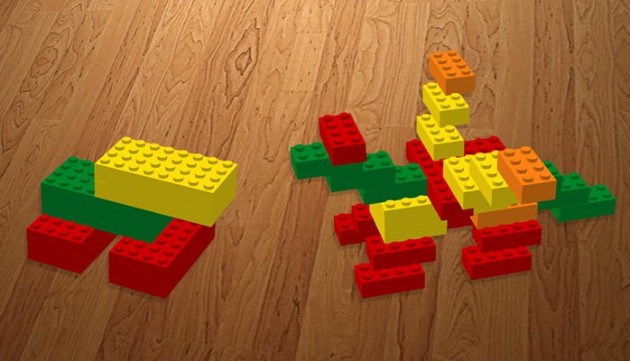



필요한 데이터를 묻기보다, 하고 싶은 걸 말해라는 Tell, Don't Ask(TDA)라는 원칙이 있다. 필요한 데이터 요청없이 행위를 실행하려면, 행위와 데이터가 함께 있어야 한다. Oriented Object Programming(OOP)은 데이터(필드)와 관련 행위(메소드)를 클래스로 한데 묶는 것이 특징인데, TDA는 이를 잘 살려주는 도구라 할만하다.

아래 `UserAccount` 클래스는 `email`과 `password` 데이터로 표현되며, 데이터베이스에 사용자 계정을 저장하기 위해 `Save`라는 행위를 가지고 있다. 데이터를 표현하는 필드, 행위를 의미하는 메소드가 동일 클래스에 위치해서 필요한 데이터를 따로 요청할 필요가 없다. TDA를 따른 것이다.

TDA가 OOP의 특징을 살려주는 도구이긴 하지만, 다른 시각에서 보면 문제가 있다.

<!-- break -->

```c#
// C#으로 작성된 코드이며, ...는 코드가 생략되었다는 뜻이다.

public class UserAcccount
{
    private string email;
    private string password;

    // 필드 초기화
    ...

    public void Save()
    {
        // 데이터베이스에 저장
        ...
    }
}
```

### Open/Closed Principle(OCP)

사용자 계정을 데이터베이스에 저장하는 대신, 파일로 저장하라는 수정 요청이 들어왔다. 이것을 구현하려면 `Save` 메소드 내부 코드를 수정해야만 한다. [확장에는 열려있어야 하고, 변경에는 닫혀 있어야 한다는 OCP를 위배한 것이다.](http://blog.ploeh.dk/2012/01/03/SOLIDisAppend-only/)

그럼 아래 코드를 보자. `DbStore` 클래스가 `Save` 메소드를 가지고 있고, 데이터베이스에 저장할 데이터를 `UserAcccount` 인스턴스에 요청하고 있다. 하고 싶은 걸 말하지 않고, 필요한 데이터를 묻는 경우다. TDA를 따르지 않는다. 그러나, 이것은 사용자 계정을 파일로 저장할 새로운 `FileStore` 클래스 작성을 가능하게 한다. 코드를 수정하거나 삭제하는 일 없이, 파일로 저장하는 새로운 기능을 추가할 수 있게 되었다. OCP를 위배하지 않은 것이다.

```c#
public class UserAcccount
{
    // 속성 초기화
    ...

    public string Email { get; }

    public string Password { get; }
}

public class DbStore
{
    public void Save(UserAccount account)
    {
        string email = acccount.Email; // TDA 위배
        string password = account.Password;

        // 데이터베이스에 저장
        ...
    }
}
```

### Single Responsibility Principle(SRP)

이제 TDA 원칙를 지키면서 사용자 이메일 주소로 메일을 전송하는 기능을 추가해보자. 이를 구현하면 아래 코드와 같은 모습이 된다. 추가된 `SendEmail` 메소드는 앞서 언급한 OCP 위배와 같은 문제를 가진다. 여기서 `UserAcccount` 클래스는 계정 저장과 메일 전송이라는 두 가지 책임을 가기게 된다. 두 책임 사항 중 하나만 변경되더라도, 코드 수정이 필요하다. 클래스를 수정하는 이유는 단 하나여야 한다는 SRP를 위배한 것이다.

```c#
public class UserAcccount
{
    private string email;
    private string password;

    ...

    public void Save()
    {
        ...
    }

    public void SendEmail()
    {
        ...
    }
}
```

SRP를 지키는 방법은 간단하다. 위 OCP 경우에서 `FileStore` 클래스를 새로 만든 것처럼, 메일 전송을 위한 새 `EmailService` 클래스를 만들면 된다. 이 클래스는 메일 전송을 위해 `UserAcccount` 인스턴스에 사용자 이메일 데이터를 요청할 것이다. TSA 원칙은 포기했지만, SRP는 지키게 되었다.

### Why OCP and SRP matter?

특정 라이브러리를 사용하면서 빠진 메소드를 추가하려 할 때, 해당 클래스가 아무런 정보를 주지 않아 당혹스러운 적이 없었는가? 메소드가 추가되길 기다리거나, private 접근자로 숨겨진 데이터를 리플렉션(reflection)으로 읽어 해결해야만 했다. TDA 원칙을 지키는게 능사가 아닌 것이다. 데이터를 공개하여 행위를 확장할 수 있도록 OCP를 지키는 것이 필요하다. [컨트롤 가능한 코드 영역(non-published interfaces)](https://martinfowler.com/bliki/PublishedInterface.html)에서 OCP를 지키지 않아 발생되는 비용은 상대적으로 크지 않다. 반면 많은 사람들이 사용하는 라이브러리를 배포한 경우(published interfaces)는 비용이 많이 든다. 사용자 계정을 파일로 저장하기 위해 `Save` 메소드 코드를 수정하거나, 메일을 전송하기 위해 `SendEmail` 메소드를 추가했다면, 빌드 후 새로운 버전을 배포해야 사용자들이 해당 기능을 사용할 수 있다. Breaking changes라도 생긴다면 비용은 더욱 증가하게 된다.

TDA 원칙을 따르다면 행위는 관련 데이터가 속한 클래스에 추가되어야 한다. 행위가 하나, 둘씩 추가되면 클래가 비대해지는데, SRP를 위배할 가능성이 점점 높아간다. 특정 데이터에 관련된 모든 행위는 그 데이터가 속한 클래스에서 처리되길 바라게 된다. 그러나 그 클래스가 [모든 행위를 가지는 God object이길 바라면 안된다.](https://en.wikipedia.org/wiki/God_object)

OCP와 SRP를 따를수록 클래스가 가지는 행위 수는 점점 작아지고, 클래스 수는 반대로 점점 커지는 경향이 있다. 작은 수의 클래스에서 각 클래스가 가지는 많은 행위를 사용하기 보다(coarse-grained), 클래스는 많지만 각 클래스가 가지는 작은 행위를 필요에 따라 잘 골라 쓰는 방향(small-grained)으로 간다. 클래스 수가 많으면 선택하는데 어려움을 겪는다는 의견이 있는데, 네임스페이스와 Nested 클래스가 좋은 해결 도구가 된다. 관련 있는 클래스끼리 묶은 후, 의미 있는 그룹 이름을 부여할 수 있다.

coarse-grained와 small-grained 비교를 위해 재미있는 일화를 하나 소개할까 한다. 어느날 [Mark Seemann](http://blog.ploeh.dk/)의 세살배기 아들이 Duplo 블럭 한 주먹을 가져와 용을 만들어 달라고 한다. 어린 아들 손에 들린 몇 안되는 블럭으로는, 아래 왼쪽 그림처럼 만드는 것이 그가 할 수 있는 최선이었다. 다행히 아들은 만족했다고 한다. 좀 더 작은 Lego 블럭이었다면, 같은 부피(1 duplo = 8 lego)로 그는 오른쪽 그림과 같은 용을 만들었을 것이다.


_Mark Seemann이 위 그림의 credits을 가진다. [Encapsulation and SOLID]((https://app.pluralsight.com/library/courses/encapsulation-solid/table-of-contents))라는 그의 온라인 강좌에서 오리지날 그림이 소개되었다. [Anastasios Piotopoulos는 오리지날 그림과 동일하게 위 그림을 제작했다.](https://www.linkedin.com/pulse/how-unit-bias-can-prevent-us-from-designing-better-piotopoulos)_

블럭의 부피를 행위량으로 생각해보면, 그림 왼쪽이 coarse-grained 오른쪽이 small-grained이다. small-grained 접근은 동일한 행위량을 사용하는데도 불구하고, coarse-grained보다 더 정교한 표현이 가능하다. 필요한 행위만 골라 선택적으로 사용할 수 있는 까닭이다. 반면 coarse-grained 접근은 필요하지 않은 행위까지 덩어리로 함께 사용해서 coarse-grained 같은 정교한 표현이 어려운 것이다.

### Conclusion

TDA 원칙은 데이터와 관련 행위를 클래스로 한데 묶는 것이 특징을 잘 살려주는 도구다. 하지만 TDA 원칙을 따르면 OCP와 SRP을 위배할 가능성이 점점 커진다. 그 종착역에선 God object가 기다리고 있다. 필요한 데이터를 묻기도 하고, 때로는 하고 싶은 걸 말하기도 해라. 이 갈림길에 서게 된면 어느 길이 지름길인지를 고민하자.