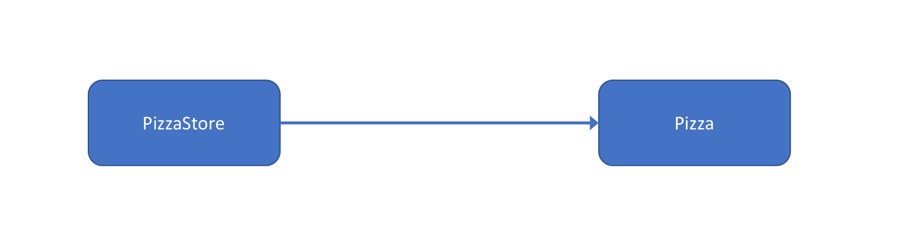
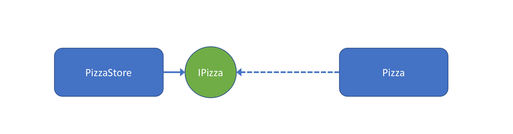
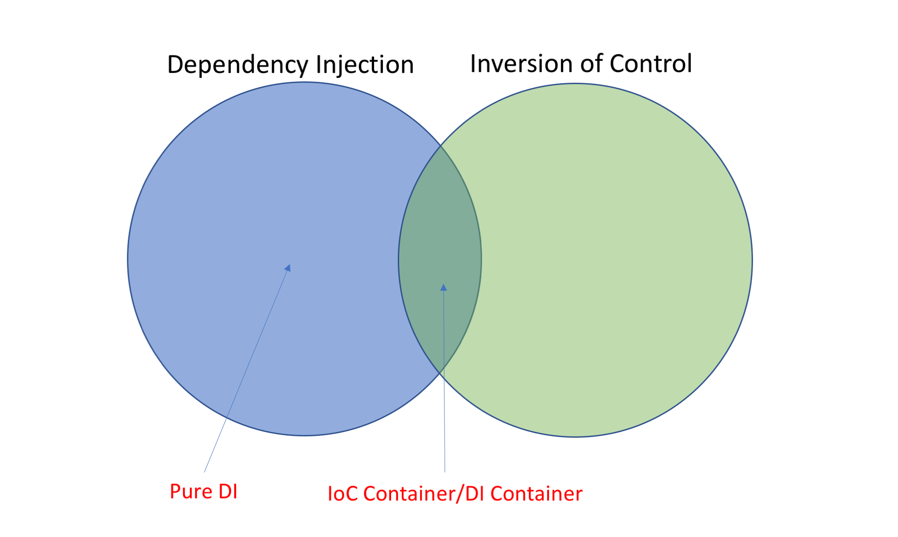



Dependency Injection(DI)을 얘기할 때 빠지지 않는 글이 있다. [Martin Folwer의 Inversion of Control Containers and the Dependency Injection pattern이다.](https://martinfowler.com/articles/injection.html) 이 글에서 DI란 용어가 생겨나게된 배경을 볼 수 있다. 관련한 내용을 인용하면 다음과 같다.

> When these containers talk about how they are so useful because they implement "Inversion of Control" I end up very puzzled. Inversion of control is a common characteristic of frameworks, so saying that these lightweight containers are special because they use inversion of control is like saying my car is special because it has wheels.

> As a result I think we need a more specific name for this pattern. Inversion of Control is too generic a term, and thus people find it confusing. As a result with a lot of discussion with various IoC advocates we settled on the name Dependency Injection.

의존성 조립 임무를 담당하는 컨테이너는 Inversion of Control(IoC) 사용이 당연한 것으로  얘기된다. 자동차가 바퀴를 가져서 특별하다고 하면 어색한 것처럼 말이다. 그래서 좀 더 특별한 이름이 필요해, 많은 사람과 토론한 끝에 DI란 용어를 정했다고 한다.

나는 DI가 IoC 사용을 포함한다는 것에 강한 반감을 가지고 있다. IoC가 없는 DI도 큰 장점을 가지기 때문이다. 이 주장에 대한 근거를 말하기 전에, 먼저 DI와 IoC가 무엇인지 이해할 필요가 있다. 이 둘은 많이 혼돈되는 주제다. 좀 더 명확한 개념을 잡기 위해 Dependency Inversion Principle(DIP)까지 함께 얘기해보도록 하자.

<!-- break -->

### Dependency Injection

아래 코드는 피자가게에서 피자를 팔고 있는 시나리오를 표현하고 있다. 피자가게 예제는 단순해서 실제 프로젝트에서 사용되는 코드와 동 떨어져 있지만, 개념을 집중해서 설명하는 데는 효과적이라 생각했다.

`PizzaStore` 인스턴스는 정해진 개수의 `Pizza` 인스턴스를 직접 가지고 있다. 만약 3개를 초과하는 피자를 팔고 싶다면 [`PizzaStore` 클래스를 수정해야 한다. OCP를 위반하게 된다.](https://en.wikipedia.org/wiki/Open/closed_principle)

```c#
// C# 코드로 작성되었다. "..." 는 코드가 생략되었다는 의미다.

public class PizzaStore
{
    private readonly Pizza[] pizzas =
        new Pizza[]
        { 
            new Pizza(),
            new Pizza(),
            new Pizza()
        };

    public void Sell(int count)
    {
        // pizzas 필드를 사용해 피자를 판매한다.
        ...
    }
}
```

OCP 위반은 `PizzaStore` 클래스가 `Pizza` 배열을 직접 참조하기 때문에 발생한다. `Pizza` 배열을 인수(argument)로 취하면 문제가 해결된다. 아래와 같이 `PizzaStore` 인스턴스를 생성할 때 필요한 만큼 `Pizza` 배열을 넘겨주면 되는 것이다. **인수를 취하는 것이 DI의 개념의 대부분이다**고 말해도 과언이 아니다.

```c#
public class PizzaStore
{
    private readonly Pizza[] pizzas;

    public PizzaStore(Pizza[] pizzas)
    {
        this.pizzas = pizzas;
    }

    public void Sell(int count)
    {
        // pizzas 필드를 사용해 피자를 판매한다.

        ...
    }
}
``` 

 [Rúnar Bjarnason는 한 세미나에서 다음과 같이 DI는 인수를 취하는 것을 허세적으로 표현한 것에 지나지 않는다고 했다.](https://www.youtube.com/watch?v=ZasXwtTRkio)

> Dependency Injection is really just a pretentious way to say 'taking an argument'.

[DI 주제로 500 페이지 넘게 책을 쓴 Mark Seemann](https://www.amazon.com/Dependency-Injection-NET-Mark-Seemann/dp/1935182501)은 적어도 이 표현에 반대할 거라 생각했지만, [오히려 그는  Rúnar Bjarnason 표현이 틀렸다기보다 추가될 내용이 있다고 말했다.](http://blog.ploeh.dk/2017/01/27/dependency-injection-is-passing-an-argument/)

Mark Seemann의 추가 내용을 설명하기 위해 아래 `IPizzaStore` 인터페이스를 도입하자. 위에서 언급된 `PizzaStore` 클래스가 이 인터페이스를 구현했다고 가정해보자. `Pizza` 배열이 인수로 넘겨지지만, `IPizzaStore` 인터페이스(추상화)는 전혀 그 정보를 담고 있지 않다. 그는 이 점을 강조했다. **추상화를 해치지 않고 의존성을 인수로 넘겨주는 방법이 DI**라고 말이다. 이것이 내가 말하고 싶은 DI 개념의 전부이다.

```c#
public interface IPizzaStore
{
    void Sell(int count);
}
```

### Dedendency Inversion Principle

피자가게에서는 대게 한 종류의 피자가 아니라, 여러 종류의 피자를 팔고 있다. 불행히도 위 코드로는 이 시나리오 구현이 불가능하다. 문제는 `PizzaStore`가 `Pizza` 타입에 의존하고 있기 때문이다. 아래 그림에서 보듯이, 더 중요한 `PizzaStore` 클래스가 덜 중요한 `Pizza` 클래스에 의존한 것이다. DIP를 위반하고 있다.



덜 중요한 `Pizza` 클래스가 더 중요한 `PizzaStore`에 의존하게 만들어야 한다. 아래 그림과 같이 `IPizza` 인터페이스(추상화)를 도입해 DIP 문제를 해결해보자. 위 그림에서 `PizzaStore` 클래스가 `Pizza` 클래스를 의존(참조, 실선)하는 것에서, `Pizza` 클래스가 `IPizza` 인터페이스에 의존(인터페이스 구현, 점선)하게 만들자. **화살표 방향이 뒤집히는 것**(역전)을 확인할 수 있다. DIP 원칙을 지켜 이제는 다양한 종류의 피자를 피자가게의 생성자로 넘겨줄 수 있게 되었다.



DIP 원칙을 나타내는 아래 두 문장과 함께 DIP를 한번 정리하고 넘어가는 것이 좋겠다. 더 중요한 모듈이 덜 중요한 모듈에 의존하면 안된다. 이 관계를 뒤집기 위해 추상화가 필요하다. 아울러 추상화가 실체에 의존해서는 안된다. 추상화 타입의 멤버필드, 메소드 반환 값 또는 인자(parameter)가 구체타입으로 표현되어서는 안된다.

> A. High-level modules should not depend on low-level modules. Both should depend on abstractions.  
B. Abstractions should not depend on details. Details should depend on abstractions.

DI는 으레 DIP를 사용한다고 생각한다. 그러나 이 둘은 별개다. DI를 사용하면서 DIP가 필요없는 경우도 많다. 예를들어 아래 `CachedUserStore` 클래스를 보자. 사용자를 `userId`를 통해 매번 조회하는 것이 아니라 일정 기간(`duration`) 동안 캐쉬하는 기능을 제공한다. `IUserStore`의 [Decorator](http://www.dofactory.com/net/decorator-design-pattern) 역할을 하는 것이다. 이때 `duration` 값이 DI를 통해 주입되지만, DIP가 필요한 것은 아니다. DI는 DIP 사용이 필수가 아니란 것을 보여준다.

```c#
public interface IUserStore
{
    User Find(string userId);
}

public class CachedUserStore : IUserStore
{
    ...

    public CachedUserStore(IUserStore innerStore, int duration)
    {
        ...
    }

    public User Find(string userId)
    {
        ...
    }
}
```

### Inversion of Control

IoC 개념은 프레임워크와 라이브라리 사용 차이에서 살펴볼 수 있다. 라이브러리를 사용하면 필요한 구성요소를 직접 가져와서 쓰면된다. 반면 프레임워크는 규칙에 따라 구성요소를 등록하면, 프레임워크에서 이 구성요소를 가져다 쓰게 된다. 이 관계에서 제어가 역전되었다고 표현한다. 같은 맥락에서 [팩토리메소드](http://www.dofactory.com/net/factory-method-design-pattern)와 [템플릿메소드](http://www.dofactory.com/net/template-method-design-pattern) 패턴 역시 IoC를 설명하기에 좋은 예가 된다.

IoC를 좀 더 외우기 쉽게 Hollywood Principle(헐리우드 원칙)이라고 한다. "내가 전에도 얘기했잖아, 나한테 먼저 연락하지마, 필요하면 내가 연락할께"라고 말이다.

피자가게 문제로 돌아가보자. DI와 DIP를 사용하여 피자가게에서는 아래 코드와 같이 원하는 종류의 피자를 필요한 개수만큼 만들어 팔 수 있게 되었다.

```c#
public static void Main()
{
    var pizzaStore = new PizzaStore(
        new IPizza[]{
            new CheezePizza(),
            new CheezePizza(),
            ...
            new ShrimpPizza(),
            new BulgogiPizza(),
            ...
        });

    ...
}
```

여기서 피자의 종류가 아주 많다면 어떻게 될까? 손으로 일일이 많은 종류의 피자를 나열해서 생성하는 것이 부담스러울 정도로 말이다. 이 번거로운 작업을 프레임워크가 해주면 좋지 않을까? 고맙게도 IoC 컨테이너가 이 역할을 해준다. 아래 코드에서는 특정 모듈(어셈블리)에 속하는 모든 `IPizza` 인터페이스 구현 타입을 IoC 컨테이너로 등록하는 것을 보여 준다. 특정 타입의 피자 클래스 생성자는 사용자에 의해 직접호출되는 것이 아니라, IoC 컨테이너에 의해 호출된다. 인스턴스 생성방향이 역전되어, 헐리우드 원칙이 적용된 것이다.

```c#
public static void Main()
{
    Type[] pizzaTypes = Assembly.GetEntryAssembly()
        .GetExportedTypes()
        .Where(typeof(IDisposable).IsAssignableFrom);

    var builder = new IoCContainerBuilder();
    buildr.RegisterTypes(pizzaTypes);

    IoCContainer container = builder.Build();

    IPizza[] allKindOfPizza = container.Resolve<IPizza[]>();

    var pizzaStore = new PizzaStore(allKindOfPizza);

    ...
}
```

### Pure DI

DI와 DIP가 별개이듯, IoC도 그렇다. DI를 사용한다고 IoC 컨테이너가 무조건 필요한 것이 아니다. 얼마든지 피자가게 생성자 인수에 피자 인스턴스를 넘겨줄 수 있다. 이것이 DI 개념에 반하는 것이 아니다.

Mark Seemann은 IoC 컨테이너를 사용하지 않는 DI에 대해 Pure DI라고 했다. 애초에 그는 [Dependency Injection in .NET라는 그의 책](https://www.amazon.com/Dependency-Injection-NET-Mark-Seemann/dp/1935182501)에서 이 용어 대신 Poor Man's DI라는 용어를 사용했다. [하지만 Poor Man이라는 뜻에서 오는 부정적인 의미 때문에 IoC 컨테이가 없는 DI의 강점이 퇴색되는 것이 안타까웠던 모양이다.](http://blog.ploeh.dk/2014/06/10/pure-di/) 기존에 책에서 사용하고 있는 용어를 바꾸면 혼란이 있음에도 불구하고, 그는 Poor Man's DI 대신 Pure DI라 불러주길 원한다.

Pure DI의 강점이 뭐길래 용어를 바꾸는 모험을 단행한 것일까? [When to use a DI Container라는 글에서 그의 생각을 엿볼 수 있다.](http://blog.ploeh.dk/2012/11/06/WhentouseaDIContainer/) IoC 컨테이너를 사용하면 의존성 등록 비용이 적다. 일일이 손으로 하지 않아도 되니 말이다. 하지만 IoC 컨테이너를 배워고 익혀야 한다. 무엇보다 의존성이 잘못 구성되었을 경우, 컴파일 애러 대신 런타임 애러 발생이 큰 단점으로 지적된다.(Weakly typed) 피자 생성자를 IoC 컨테이너에 등록하지 않아도 컴파일 시는 문제가 되지 않는 것처럼 말이다. Weakly typed 문제는 Pure DI에서는 발생되지 않는다. `PizzaStore` 생성자에 인수를 나열하지 않고 인스턴스를 생성할 수 있는가? 당연히 컴파일 애러다. 대신 Pure DI는 의존성 등록 비용이 크다는 단점이 있다.

IoC 컨테이너와 Pure DI 어느 것을 사용해야 할까라는 의문이 생긴다. 여기에 대한 답을 찾기 전에 **DI는 IoC가 필수가 아니란 점을 강조하고 싶다.** Pure DI는 Weakly typed 문제를 해결해주는 훌륭한 도구이다. 자칫 DI와 IoC 개념을 잘못 이해해서, DI를 무조건 컨테이너와 같이 사용하는 것은 큰 문제다. 이 글을 쓴 목적이 사실 여기에 있다. **의존성 등록비용을 줄인다는 이유로 IoC 컨테이너 학습비용과 Weakly typed 비용을 고려하지 않는다면 곤란하다.**

IoC 컨테이너와 Pure DI 둘 중 어느 것을 사용할까라는 질문에 난 명확한 답을 가지고 있지 않다. [다만 경험에 비춰 본다면, 생각했던 것보다 Weakly typed 비용이 의존성 등록비용보다 크다는 것이다.](https://www.facebook.com/jinwook.chung.167/posts/1776835702551864) 그래서 나는 다음과 같은 가이드라인을 제시하고 싶다.

> 의존성 등록 비용이 Weakly typed 비용보다 크다는 확신이 있을 때까지는 Pure DI를 사용하자.

상당량 규모의 의존성 등록도 Pure DI로 한다는 것을 보여주는 코드가 있다. [AutoFixture의 Fixture 클래스 생성자인데, 재미삼아 한번 참고해보도록 하자.](https://github.com/AutoFixture/AutoFixture/blob/master/Src/AutoFixture/Fixture.cs#L63-L148)

### Inversion of Control Containers and the Dependency Injection pattern

이 글 서두에서 Martin Folwer의 DI가 IoC 사용을 포함한다는 표현에 대해 난 반감을 가진다고 했다. Pure DI에 대한 장점을 외면한 표현이라 생각하기 때문이다. 아래 벤다이어그램에서, Martin Folwer 표현은 왼쪽 DI영역이 오른쪽 IoC영역의 부분집합으로 표현되는 것이다. 그러면 그림에서 표현되고 있는 Pure DI영역을 만날 수 없게 된다. 나는 DI가 IoC를 사용한다면 두 영역의 교집합으로 표현되는 것이 맞다고 생각한다. 이를 IoC 컨테이너 또는 DI 컨테이너라 말할 수 있다.



나는 Service Locator(SL)를 안티패턴이라 생각한다. 아래와 같이 `PizzaStore`가 `Pizza`에 의존하고 있다는 정보를 드러내지 않고 있기 때문이다. 함축적인 것보다 명확한 것이 좋다. ([Explicit is better than implicit - The Zen of Python](https://www.python.org/dev/peps/pep-0020/))

```c#
public class PizzaStore
{
    private readonly Pizza[] pizzas;

    public PizzaStore()
    {
        this.pizzas = ServiceLocator.Resolve<Pizza[]>();
    }

    ....
}
```

SL을 따로 언급하고 싶지 않지만, 이 부분에서는 재미난 사실이 있다. SL을 위 벤다이어그램으로 나타낸다면 IoC 영역의 부분집합으로 그려야 한다는 것이다. SL은 IoC를 사용한 컨테이너가 필수적이란 얘기다. 따라서, **SL을 IoC의 특정한 형태라 말하는 것은 참이지만, DI를 그렇게 말하는 것은 거짓이다.**

### Summary

DI는 의존성을 어떻게 가질 것인가에 대한 문제다. 직접 의존도 가능하고, 의존성을 SL로 위치시킬 수도 있다. 의존성을 인수로 취하는 것이 DI의 특징이다. 이때 DI는 추상화를 해치지 않고 의존성을 주입할 수 있는 수단을 제공한다.

의존성을 참조하는 의존자가 만약 의존성보다 중요한 모듈(클래스)라면, 이 둘은 추상화에 의존할 필요가 있다. 자동차가 타이어를 가지는데 한 종류의 타이어만 사용한다는 것은 상상할 수 없는 일이다. 타이어 크기를 추상화해 크기만 맞으면 어떤 타이어도 사용할 수 있도록 해야 된다. 이것이 DIP다. DIP는 실체에 의존할 것이가, 추상화에 의존할 것이가의 문제다.

IoC는 프로그래밍 전반에서 흔히 접할 수 있는 기법이다. DI와 연관 지어 생각해본다면, 특정 클래스의 생성자를 직접 호출해 인스턴스를 생성하는 방법이 있다. 생성자를 일일이 호출하는 것이 번거롭다면, 이 작업을 프레임워크에 맡길 수 있을 것이다. IoC는 누가 작업을 수행하냐에 대한 얘기다.

DI는 IoC사용을 필수로 요구하지 않는다. 의존성 등록비용을 줄인다는 이유로 IoC 컨테이너 학습비용과 Weakly typed 비용을 강요해서는 안된다. Weakly typed 비용은 생각보다 클 수 있다. IoC 컨테이너에 대한 확신이 설 때까지 최대한 사용을 미루고, Pure DI에 귀를 기울일 필요가 있다. Pure DI를 사용하다 생기는 불편함이 IoC 컨테이너 사용에 대한 확신을 주며, 안내서 역할을 해줄 것이다.